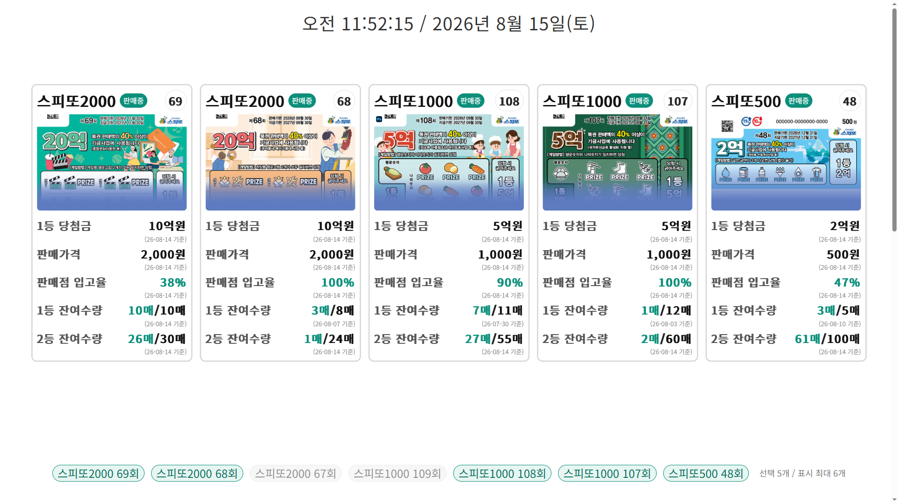
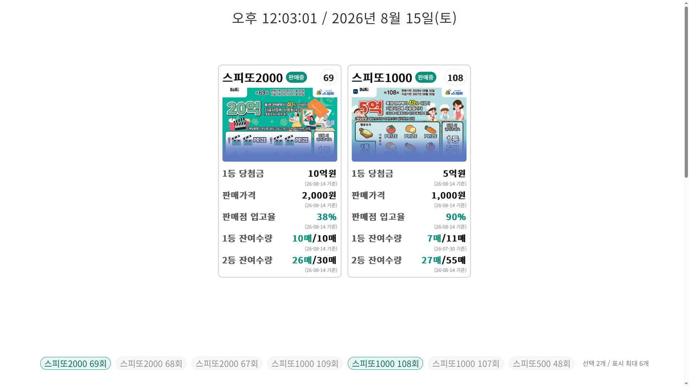
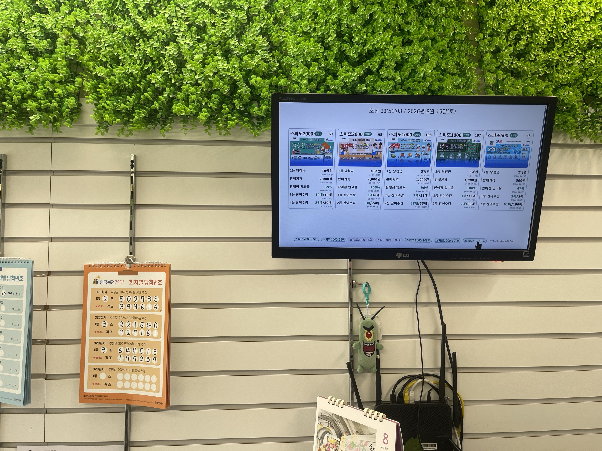
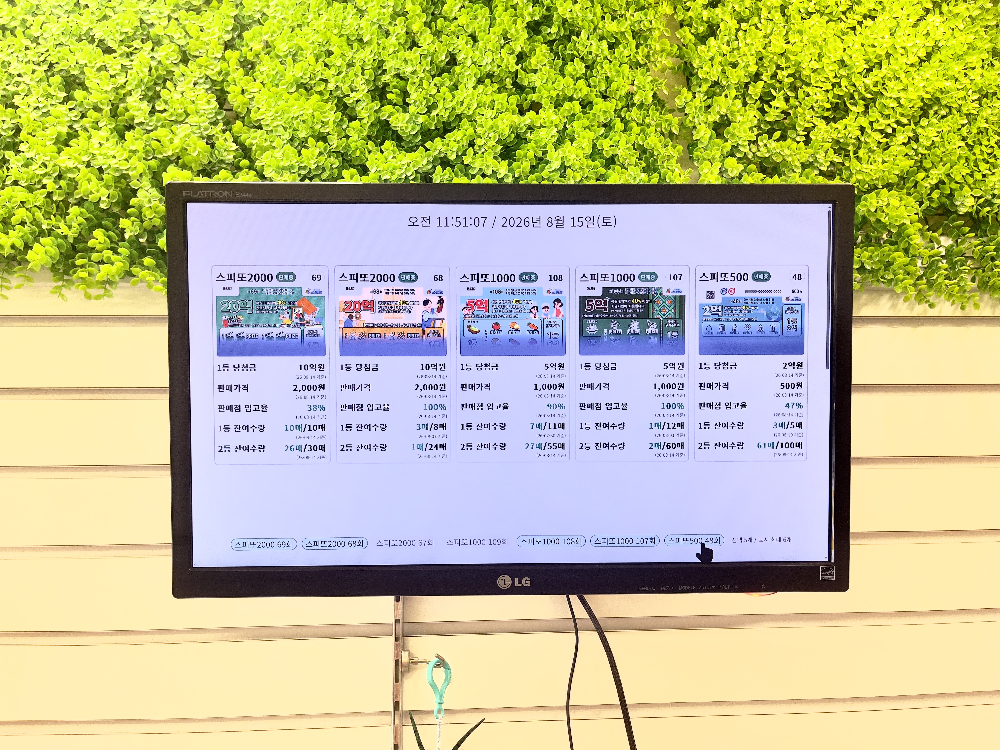

# Tampermonkey 스피또 사이니지

동행복권 홈페이지의 스피또 발행내역에서 **현재 판매중인 스피또 상품 정보를 수집하여 PC → HDMI 화면용 사이니지로 표시하는 Tampermonkey 사용자 스크립트**입니다.

매장 PC의 Chrome 브라우저에서 동행복권 스피또 발행내역 페이지를 열어두면, Tampermonkey가 판매중 상품 정보를 읽어 별도의 사이니지 화면으로 재구성합니다.

## 프로그램 개요

- 프로젝트명: `tampermonkey-spitto-signage`
- 실행 환경: Chrome + Tampermonkey
- 표시 대상: 동행복권 스피또 발행내역
- 출력 방식: PC 브라우저 → HDMI 연결 모니터/TV
- 메인 스크립트: `spitto-signage.user.js`

별도의 웹서버나 Python 프로그램은 사용하지 않습니다.

## 실행 화면

Tampermonkey 사용자 스크립트를 적용하면 동행복권 스피또 판매현황을
매장 모니터나 HDMI 디스플레이에서 보기 편한 형태로 표시할 수 있습니다.

### 전체 상품 표시

현재 판매 중인 상품 가운데 사용자가 선택한 상품을 한 화면에 표시합니다.



화면 상단에는 현재 날짜와 시각을 초 단위까지 표시하며,
각 카드에는 다음 정보가 표시됩니다.

- 상품명 및 회차
- 판매 상태
- 복권 이미지
- 1등 당첨금
- 판매가격
- 판매점 입고율
- 1등 잔여수량
- 2등 잔여수량
- 각 정보의 기준일

화면 하단에서는 표시할 상품을 직접 선택할 수 있습니다.

### 상품 선택 표시

필요한 상품만 선택하면 선택된 카드 수에 맞추어 화면 중앙에 표시됩니다.



## 실제 매장 사용 모습

이 프로젝트는 실제 복권판매점의 HDMI 모니터에서 사용할 목적으로 제작하였으며,
현재 실제 매장에서 사용하고 있습니다.

### 매장 모니터



### 매장 설치 모습



> 본 프로젝트는 동행복권에서 공식적으로 개발하거나 배포한 프로그램이 아닙니다.
> 동행복권 홈페이지에 공개된 정보를 사용자의 브라우저에서 보기 편하게 재구성하는
> Tampermonkey 사용자 스크립트입니다.

## 주요 기능

### 판매중 스피또 자동 수집

동행복권 스피또 발행내역 페이지에서 `판매중` 상태인 상품만 수집합니다.

현재 최대 표시 개수는 다음과 같습니다.

```text
5개
```

현재 페이지에 판매중 상품이 부족하면 다음 페이지를 탐색하여 최대 5개까지 수집합니다.

### 사이니지 전용 화면

동행복권 원본 페이지를 직접 수정하지 않고 별도의 오버레이 화면을 생성합니다.

표시되는 주요 정보:

- 스피또 상품명
- 판매 상태
- 회차
- 상품 이미지
- 1등 당첨금
- 판매가격
- 판매점 입고율
- 1등 잔여수량
- 2등 잔여수량
- 각 항목의 기준일

### 잔여수량 색상 구분

잔여수량은 다음과 같이 표시합니다.

```text
6매/18매
```

- 현재 잔여수량 `6매` : 청록색
- `/18매` : 검정색

판매점 입고율은 청록색으로 강조합니다.

### 현재시각 표시

사이니지 상단에 현재 날짜와 시간을 표시합니다.

표시 예:

```text
오후 6:28:37 / 2026년 4월 18일(토)
```

시계는 1초마다 갱신됩니다.

### 자동 새로고침

동행복권 데이터 갱신을 위해 페이지를 일정 시간마다 자동 새로고침합니다.

현재 설정:

```text
240분
```

즉, 하루 6회 새로고침합니다.

## 설치 방법

### 1. Tampermonkey 설치

Chrome 브라우저에 Tampermonkey 확장 프로그램을 설치합니다.

Tampermonkey가 동행복권 사이트에서 사용자 스크립트를 실행할 수 있도록 사이트 접근 권한을 허용해야 합니다.

### 2. 사용자 스크립트 등록

프로젝트의 다음 파일을 엽니다.

```text
spitto-signage.user.js
```

파일 전체 내용을 Tampermonkey 사용자 스크립트 편집기에 복사한 후 저장합니다.

### 3. 동행복권 페이지 접속

스크립트 적용 대상은 다음 경로입니다.

```text
dhlottery.co.kr/st/pblcnDsctn
```

`www` 유무에 관계없이 동작하도록 설정되어 있습니다.

### 4. HDMI 화면 출력

PC의 HDMI 출력에 TV 또는 모니터를 연결하고 Chrome에서 해당 페이지를 표시합니다.

브라우저를 전체화면으로 사용하면 매장 사이니지 화면으로 사용할 수 있습니다.

## 주요 화면 조정값

화면 크기와 설치 환경에 따라 `spitto-signage.user.js` 상단의 설정값을 조절할 수 있습니다.

### 표시 카드 수

```javascript
const MAX = 5;
```

### 카드 폭

```javascript
const CARD_WD = 650;
```

### 전체 카드 확대/축소

```javascript
const CARD_SCALE = 0.55;
```

### 카드 사이 간격

```javascript
const GALLERY_GAP = 34;
```

### 카드 테두리

```javascript
const CARD_RADIUS = 22;
const CARD_BORDER = 5;
const CARD_BORDER_COLOR = '#d7d7d7';
```

### 제목 및 회차 글자 크기

```javascript
const HDR_FONT = 60;
const HDR_STATUS_FONT = 30;
const HDR_ROUND_FONT = 45;
```

### 상세정보 글자 크기

```javascript
const BODY_FONT = 45;
const BODY_VALUE_FONT = 45;
const BODY_BASE_FONT = 25;
```

### 시계

```javascript
const CLOCK_FONT_SIZE = 90;
const CLOCK_WEIGHT = 900;
```

### 카드 세로 위치

```javascript
const CLOCK_BOTTOM_GAP = 70;
const CARDS_PUSH_DOWN = 40;
```

## 프로젝트 구조

```text
tampermonkey-spitto-signage/
├── spitto-signage.user.js
├── README.md
├── CHANGELOG.md
├── .gitignore
└── docs/
    └── screenshots/
```

## 운영 주의사항

이 스크립트는 동행복권 홈페이지의 HTML 구조를 기준으로 동작합니다.

동행복권 홈페이지의 다음 요소가 변경될 경우 일부 기능이 동작하지 않을 수 있습니다.

- 카드 DOM 구조
- CSS 클래스명
- 판매 상태 표시 방식
- 페이지 이동 방식
- 상품 상세정보 문구

이 경우 `spitto-signage.user.js`의 카드 탐색 및 데이터 추출 부분을 점검해야 합니다.

동행복권 페이지의 원본 데이터를 변경하거나 서버로 데이터를 전송하지 않습니다.

## 민감정보

현재 프로젝트에는 API Key, 비밀번호, 토큰 등의 민감정보를 사용하지 않습니다.

향후 민감정보가 추가되는 경우 GitHub에 직접 커밋하지 않습니다.

## 최근 변경사항

### 2026-08-15

- 독립 GitHub 프로젝트 구조 생성
- Tampermonkey 스피또 사이니지 코드 정리
- 판매중 카드 최대 5개 수집
- 여러 페이지 판매중 카드 탐색
- 카드 오버레이 방식 적용
- 회차번호 표시
- 기준일 표시
- 잔여수량 분자/분모 색상 구분
- 현재 날짜 및 시:분:초 시계 표시
- 240분 자동 새로고침 적용

상세 변경이력은 `CHANGELOG.md`를 참고합니다.


## 라이선스

이 프로젝트는 MIT License로 공개됩니다.

- 영문 원문: [LICENSE](LICENSE)
- 한글 안내: [LICENSE.ko.md](LICENSE.ko.md)

자유롭게 사용·수정·배포할 수 있으며, 재배포 시 원 저작권 표시와 MIT License를 유지해야 합니다.


## 문의 및 개발 의뢰

이 프로젝트는 무료로 공개하는 개인 프로젝트입니다.

사용 문의, 오류 제보, 기능 개선 의견 및 별도 프로그램 개발 의뢰는 아래 이메일로 보내주실 수 있습니다.

- 개발자: WOOSOK KOH
- 이메일: woosok.koh@justmlab.com

### 지원 및 A/S 안내

이 프로젝트는 별도의 유지보수 계약이나 유료 지원 계약 없이 무료로 공개되는 소프트웨어이므로 **별도의 A/S를 제공하지 않습니다.**

오류 제보나 수정 요청을 이메일 또는 GitHub Issues를 통해 보내주실 수는 있으나, 다음 사항을 미리 양해해 주세요.

- 모든 문의에 답변을 드리는 것을 보장하지 않습니다.
- 오류가 확인되더라도 즉시 수정하는 것을 보장하지 않습니다.
- 요청하신 기능을 반드시 추가하는 것을 보장하지 않습니다.
- 동행복권 홈페이지의 구조 변경으로 프로그램이 동작하지 않게 된 경우에도 즉각적인 대응을 보장하지 않습니다.
- 개발자의 개인 일정과 개발 여건에 따라 수정 여부 및 시기가 결정됩니다.
- 무료 배포본에 대한 개별 설치, 원격지원, 환경설정 등의 기술지원은 기본적으로 제공하지 않습니다.

다만 여러 사용자에게 공통적으로 발생하는 오류나 프로그램 운영에 중대한 영향을 주는 문제는 가능한 범위에서 향후 버전에 반영할 수 있습니다.

### 별도 개발 의뢰

이 프로젝트와 별개로 프로그램 개발, 기능 추가, 업무 자동화 등의 **별도 개발 의뢰는 이메일로 문의하실 수 있습니다.**

별도 개발 의뢰는 이 무료 공개 프로젝트의 오류 수정이나 A/S와는 별개의 사항이며, 내용과 범위에 따라 별도로 협의합니다.
